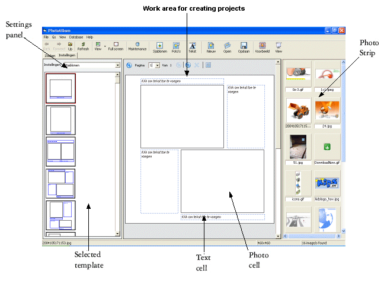



## photoalbum Update1

### Description

Update Photoalbum. Thumbnail your pages to easy view page. You can create an album page using one of the many available template layouts. Just select an album page layout, put pictures into the cells, add text,You&#8217;ll quickly have an array of album pages that You can use as slide show presentations with different effects in a new window. Please leave your comments, thanks
 
### More Info
 

             |
---                |---
**Submitted On**   |2006-08-29 15:29:30
**By**             |[Erwin Christiaens](https://github.com/Planet-Source-Code/PSCIndex/blob/master/ByAuthor/erwin-christiaens.md)
**Level**          |Intermediate
**User Rating**    |4.9 (54 globes from 11 users)
**Compatibility**  |VB 6\.0
**Category**       |[Graphics](https://github.com/Planet-Source-Code/PSCIndex/blob/master/ByCategory/graphics__1-46.md)
**World**          |[Visual Basic](https://github.com/Planet-Source-Code/PSCIndex/blob/master/ByWorld/visual-basic.md)
**Archive File**   |[photoalbum2016748312006\.zip](https://github.com/Planet-Source-Code/erwin-christiaens-photoalbum-update1__1-66338/archive/master.zip)

